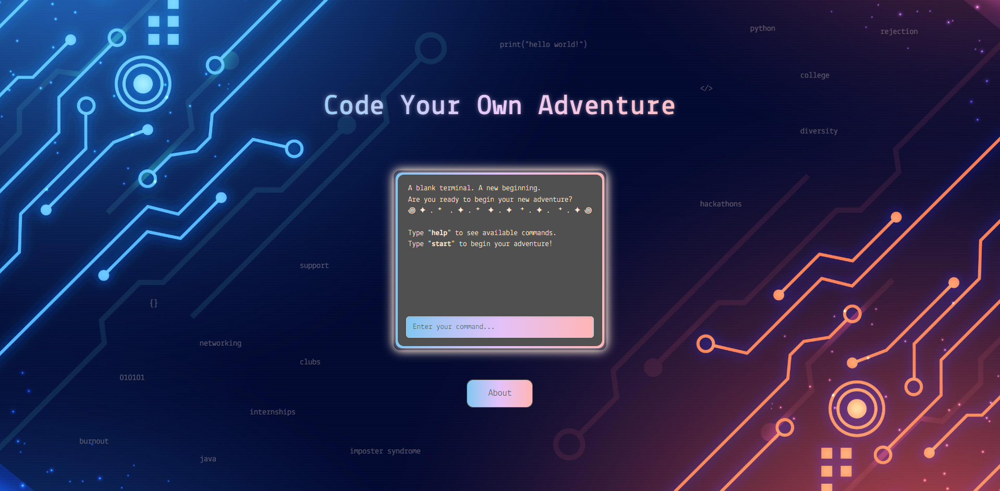
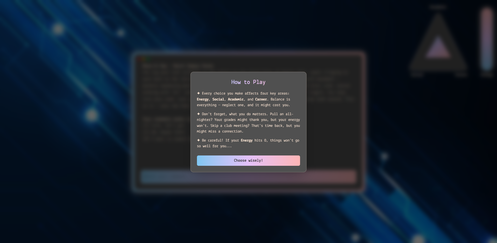
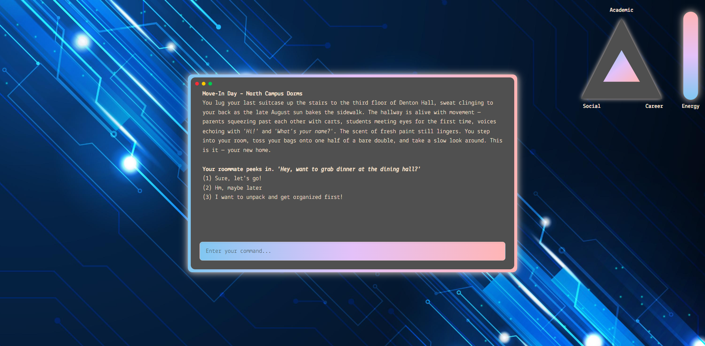

# Code Your Own Adventure

A narrative-driven college simulator built with React, TypeScript, and Tailwind CSS.



## Overview

**Code Your Own Adventure** is an interactive, text-based game that simulates the computer science college experience through a terminal-style interface. Built with storytelling and reflection in mind, the game guides players through realistic academic, social, and career decisions—complete with branching scenarios, stat tracking, and energy management.

Inspired by "Choose Your Own Adventure" narratives, the game encourages players to explore the many paths to growth in college—without prescribing a single "right" way to succeed.

## Tech Stack

- React
- TypeScript
- Tailwind CSS
- JSON (for scenario logic and branching)
  
## Features

- Stat-based gameplay: Academic, Social, and Career axes
- Energy system that constrains decision-making under realistic fatigue
- Modular JSON-driven scenario engine with support for semester-based expansion
- Terminal-style UI styled with Tailwind CSS
- UMD-themed events grounded in real student experiences

## Screenshots

### Title Screen


### How to Play


### In-Game Scenario


## How to Run

```bash
git clone https://github.com/your-username/code-your-own-adventure.git
cd code-your-own-adventure
npm install
npm run dev
